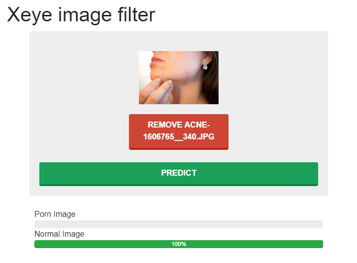
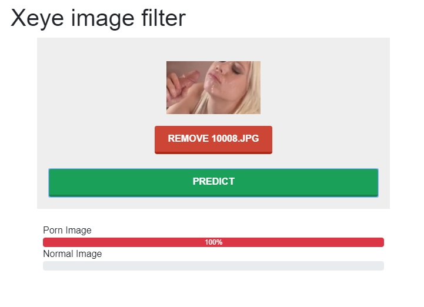

# Xeye
Xeye is made by python 3.7, Flask and Machine learning(Tensorflow).

# Purpose
Xeye work to filter porn image.

# Service
## Page
### {http://127.0.0.1:5001}/
* Method: GET
* Service page:
    * 
    * 
## API
### {http://127.0.0.1:5001}/xeye/predict/file
* Method: POST
* Request:
```
<form action="/xeye/predict/file" method="POST"
      enctype="multipart/form-data">
    <input type="file" name="file"/>
    <input type="submit"/>
</form>
```
### {http://127.0.0.1:5001}/xeye/predict/url
* Method: POST
* Request: 
```
Request body:
{
	"url": "https://ei.rdtcdn.com/m=eGJF8f/media/videos/201902/28/14197691/original/13.jpg"
}
```

### Response
#### SUCCESS
```
Response nody:
{
    "status": "SUCCESS"
    "data": "{0: {'label': 'Porn_Image', 'rate': ca}, 1: {'label': 'Normal_Image', 'rate': 0.0000001‬}}",
}
```
#### FAIL
```
Response nody:
{
    "status": "FAIL"
    "message": "Can't predict image file.",
}
```
# Version 
| Version | Release date | Normal fail/total count | Normal accuracy | Porno fail/total count | Porno accuracy | Remark                                              |
|---------|--------------|-------------------------|-----------------|------------------------|----------------|-----------------------------------------------------|
| 1.0.0   | 05/06/2020   | 45/3020                 | 98.50%          | 48/6622                | 99.27%         | Learning normal image 200 and porn image 200        |
| 1.0.1   | 05/06/2020   | 5/3020                  | 99.83%          | 30/6681                | 99.55%         | Version 1.0.0 add normal image 45 and porn image 48 |
| 1.0.2   | 05/06/2020   | 6/3020                  | 99.70%          | 25/6687                | 99.62%         | Version 1.0.1 add normal image 4 and porn image 30  |
| 1.0.2   | 05/06/2020   |                         |                 | 12/34331               | 99.96%         | Others(redtube) 34,331 porn image                   |
| 1.0.3   | 05/07/2020   |                         |                 |                        |                |                                                     |

# License
```
Copyright (c) 2020 by Hyunkeun Park (https://github.com/hermes7308/xeye)

Permission is hereby granted, free of charge, to any person obtaining a copy of this software and associated documentation files (the "Software"), to deal in the Software without restriction, including without limitation the rights to use, copy, modify, merge, publish, distribute, sublicense, and/or sell copies of the Software, and to permit persons to whom the Software is furnished to do so, subject to the following conditions:

The above copyright notice and this permission notice shall be included in all copies or substantial portions of the Software.

THE SOFTWARE IS PROVIDED "AS IS", WITHOUT WARRANTY OF ANY KIND, EXPRESS OR IMPLIED, INCLUDING BUT NOT LIMITED TO THE WARRANTIES OF MERCHANTABILITY, FITNESS FOR A PARTICULAR PURPOSE AND NONINFRINGEMENT. IN NO EVENT SHALL THE AUTHORS OR COPYRIGHT HOLDERS BE LIABLE FOR ANY CLAIM, DAMAGES OR OTHER LIABILITY, WHETHER IN AN ACTION OF CONTRACT, TORT OR OTHERWISE, ARISING FROM, OUT OF OR IN CONNECTION WITH THE SOFTWARE OR THE USE OR OTHER DEALINGS IN THE SOFTWARE.
```